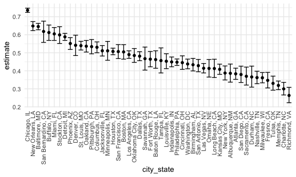
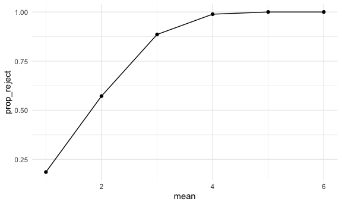
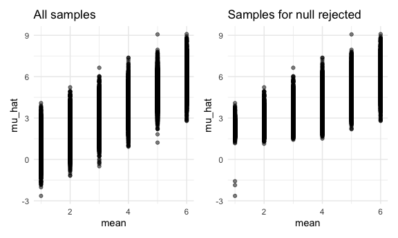

P8105 HW5
================
Jennifer Lee (UNI: jl2361)
2022-11-08

# Problem 1

## Data load & tidying

This zip file contains data from a longitudinal study that included a
control arm and an experimental arm. Data for each participant is
included in a separate file, and file names include the subject ID and
arm.

Create a tidy dataframe containing data from all participants, including
the subject ID, arm, and observations over time:

Start with a dataframe containing all file names; the list.files
function will help

Iterate over file names and read in data for each subject using
purrr::map and saving the result as a new variable in the dataframe

Tidy the result; manipulate file names to include control arm and
subject ID, make sure weekly observations are “tidy”, and do any other
tidying that’s necessary

## Plot

Make a spaghetti plot showing observations on each subject over time,
and comment on differences between groups.

# Problem 2

## Data load & tidying

First, we load the homicide data and do some data tidying.

``` r
homicide_df = 
  read.csv("https://raw.githubusercontent.com/washingtonpost/data-homicides/master/homicide-data.csv") %>%
  janitor::clean_names() %>%
  mutate(
    state = toupper(state),
    city_state = str_c(city, state, sep = ", ") %>% 
    str_replace("Tulsa, AL", "Tulsa, OK"))
```

The raw data reports data on homicides in 50 U.S. cities describing the
date, location, victim details, and case disposition. There are 52179
rows/observations and 13 columns/variables after we create the
`city_state` variable. We note that some state abbreviations are not
completely capitalized and that there appears to be a typo for the city
of Tulsa, so we fix these data entry errors.

Next, we create a dataframe summarizing the number of total homicides by
city and state, in addition to the number of unsolved homicides
categroized by “Closed without arrest” or “Open/No arrest.”

``` r
number_homicide_df = 
  homicide_df %>%
  group_by(city_state) %>%
  summarize(number_homicide = n()) 

number_unsolved_homicide_df = 
  homicide_df %>%
  filter(disposition %in% c("Closed without arrest", "Open/No arrest")) %>%
  group_by(city_state) %>%
  summarize(number_unsolved_homicide = n()) 

homicide = 
  left_join(number_unsolved_homicide_df, number_homicide_df, by = "city_state") 

homicide %>%
  knitr::kable()
```

| city_state         | number_unsolved_homicide | number_homicide |
|:-------------------|-------------------------:|----------------:|
| Albuquerque, NM    |                      146 |             378 |
| Atlanta, GA        |                      373 |             973 |
| Baltimore, MD      |                     1825 |            2827 |
| Baton Rouge, LA    |                      196 |             424 |
| Birmingham, AL     |                      347 |             800 |
| Boston, MA         |                      310 |             614 |
| Buffalo, NY        |                      319 |             521 |
| Charlotte, NC      |                      206 |             687 |
| Chicago, IL        |                     4073 |            5535 |
| Cincinnati, OH     |                      309 |             694 |
| Columbus, OH       |                      575 |            1084 |
| Dallas, TX         |                      754 |            1567 |
| Denver, CO         |                      169 |             312 |
| Detroit, MI        |                     1482 |            2519 |
| Durham, NC         |                      101 |             276 |
| Fort Worth, TX     |                      255 |             549 |
| Fresno, CA         |                      169 |             487 |
| Houston, TX        |                     1493 |            2942 |
| Indianapolis, IN   |                      594 |            1322 |
| Jacksonville, FL   |                      597 |            1168 |
| Kansas City, MO    |                      486 |            1190 |
| Las Vegas, NV      |                      572 |            1381 |
| Long Beach, CA     |                      156 |             378 |
| Los Angeles, CA    |                     1106 |            2257 |
| Louisville, KY     |                      261 |             576 |
| Memphis, TN        |                      483 |            1514 |
| Miami, FL          |                      450 |             744 |
| Milwaukee, WI      |                      403 |            1115 |
| Minneapolis, MN    |                      187 |             366 |
| Nashville, TN      |                      278 |             767 |
| New Orleans, LA    |                      930 |            1434 |
| New York, NY       |                      243 |             627 |
| Oakland, CA        |                      508 |             947 |
| Oklahoma City, OK  |                      326 |             672 |
| Omaha, NE          |                      169 |             409 |
| Philadelphia, PA   |                     1360 |            3037 |
| Phoenix, AZ        |                      504 |             914 |
| Pittsburgh, PA     |                      337 |             631 |
| Richmond, VA       |                      113 |             429 |
| Sacramento, CA     |                      139 |             376 |
| San Antonio, TX    |                      357 |             833 |
| San Bernardino, CA |                      170 |             275 |
| San Diego, CA      |                      175 |             461 |
| San Francisco, CA  |                      336 |             663 |
| Savannah, GA       |                      115 |             246 |
| St. Louis, MO      |                      905 |            1677 |
| Stockton, CA       |                      266 |             444 |
| Tampa, FL          |                       95 |             208 |
| Tulsa, OK          |                      193 |             584 |
| Washington, DC     |                      589 |            1345 |

## Using prop.test

We then create a `myproptest` function to apply the prop.test function
to estimate the proportio of homicides that are unsolved, apply the
broom::tidy, and save the output (estimated proportion and upper and
lower bounds of the 95% CI) as a tibble. We use `myproptest` for the
city of Baltimore, MD and note that the filtered dataframe needs to be
converted to a list of vectors prior to applying `myproptest`.

``` r
myproptest = function(x) {
  
    estimate = 
      prop.test(x[[2]], x[[3]]) %>% 
      broom::tidy() %>%
      select(estimate)
    conf_low = 
      prop.test(x[[2]], x[[3]]) %>% 
      broom::tidy() %>%
      select(conf.low)
    conf_high = 
      prop.test(x[[2]], x[[3]]) %>% 
      broom::tidy() %>%
      select(conf.high)

tibble(
  estimate, 
  conf_low,
  conf_high) %>%
  rename(
      conf_low = conf.low,
      conf_high = conf.high)

  }

baltimore = 
  homicide %>% 
    filter(city_state %in% c("Baltimore, MD")) %>% 
  as.list() %>%
  myproptest()

baltimore
```

    ## # A tibble: 1 × 3
    ##   estimate conf_low conf_high
    ##      <dbl>    <dbl>     <dbl>
    ## 1    0.646    0.628     0.663

Now, we run `prop.test` for each of the cities in the dataset and
extract both the proportion of unsolved homicides and the CIs for each
within a “tidy” pipeline, making use of purrr::map2, list columns, and
unnest.

``` r
homicide_prop = 
  homicide %>%
   mutate(
    prop_data = map2(number_unsolved_homicide, number_homicide, ~ prop.test(.x, .y) %>%
      broom::tidy())) %>%
  unnest(prop_data) %>%
  select(city_state, estimate, conf.low, conf.high) %>%
  rename(
    conf_low = conf.low,
    conf_high = conf.high)

homicide_prop
```

    ## # A tibble: 50 × 4
    ##    city_state      estimate conf_low conf_high
    ##    <chr>              <dbl>    <dbl>     <dbl>
    ##  1 Albuquerque, NM    0.386    0.337     0.438
    ##  2 Atlanta, GA        0.383    0.353     0.415
    ##  3 Baltimore, MD      0.646    0.628     0.663
    ##  4 Baton Rouge, LA    0.462    0.414     0.511
    ##  5 Birmingham, AL     0.434    0.399     0.469
    ##  6 Boston, MA         0.505    0.465     0.545
    ##  7 Buffalo, NY        0.612    0.569     0.654
    ##  8 Charlotte, NC      0.300    0.266     0.336
    ##  9 Chicago, IL        0.736    0.724     0.747
    ## 10 Cincinnati, OH     0.445    0.408     0.483
    ## # … with 40 more rows

## Plot

Finally, we create a plot that shows the estimates and CIs for each
city, and organize cities according to the proportion of unsolved
homicides. We see that Chicago, IL, New Orleans, LA, and Baltimore, MD
are the top 3 cities with the highest proportions of unsolved homicides.

``` r
homicide_prop %>%
  mutate(
    city_state = fct_reorder(city_state, estimate, .desc = TRUE)) %>%
  ggplot(
    aes(x = city_state, y = estimate)) +
  geom_point() +
  geom_errorbar(aes(ymin = conf_low, ymax = conf_high)) + 
  theme(axis.text.x = element_text(angle = 90, vjust = 0.5, hjust = 1))
```



# Problem 3

## Simulations

First, we set the following design elements:

Fix n=30 Fix σ=5 Set μ=0.

We generate 5000 datasets from the model using `expand_grid` and call
this `sim_df`:

x∼Normal\[μ,σ\]

We also create a `sim_ttest` function to map to `sim_df` and save μ̂ and
the p-value arising from a test of H:μ=0 using α=0.05

``` r
sim_ttest = function(n = 30, mean, sigma = 5) {
  
  sim_data = tibble(
    x = rnorm(n = 30, mean, sd = sigma),
  )
  mu_hat = 
    sim_data %>% 
    t.test(mu = 0, conf.level = 0.95) %>%
    broom::tidy() %>%
    select(estimate)
  p_value =
    sim_data %>% 
    t.test(mu = 0, conf.level = 0.95) %>%
    broom::tidy() %>%
    select(p.value)
  
  tibble(
    mu_hat, 
    p_value) %>%
    rename(
      mu_hat = estimate,
      p_value = p.value)

}

sim_df = 
  expand_grid(
    mean = 0,
    iter = 1:5000) %>% 
  mutate(
    ttest_df = map(.x = mean, ~ sim_ttest(mean = .x))) %>% 
  unnest(ttest_df)

sim_df
```

    ## # A tibble: 5,000 × 4
    ##     mean  iter mu_hat p_value
    ##    <dbl> <int>  <dbl>   <dbl>
    ##  1     0     1  0.604   0.565
    ##  2     0     2  0.644   0.540
    ##  3     0     3 -0.487   0.643
    ##  4     0     4  0.218   0.762
    ##  5     0     5  0.636   0.523
    ##  6     0     6  0.121   0.906
    ##  7     0     7  0.695   0.339
    ##  8     0     8 -1.20    0.116
    ##  9     0     9  0.711   0.534
    ## 10     0    10 -0.890   0.371
    ## # … with 4,990 more rows

We repeat the above for μ={1,2,3,4,5,6}.

``` r
sim_df2 = 
  expand_grid(
    mean = c(1, 2, 3, 4, 5, 6),
    iter = 1:5000) %>% 
  mutate(
    ttest_df = map(.x = mean, ~ sim_ttest(mean = .x))) %>% 
  unnest(ttest_df)

sim_df2
```

    ## # A tibble: 30,000 × 4
    ##     mean  iter mu_hat p_value
    ##    <dbl> <int>  <dbl>   <dbl>
    ##  1     1     1  1.01    0.244
    ##  2     1     2  1.44    0.149
    ##  3     1     3  0.448   0.637
    ##  4     1     4  1.55    0.114
    ##  5     1     5  0.255   0.802
    ##  6     1     6  1.58    0.109
    ##  7     1     7 -0.878   0.307
    ##  8     1     8  1.07    0.198
    ##  9     1     9  1.00    0.340
    ## 10     1    10  1.03    0.260
    ## # … with 29,990 more rows

## Plots

Here is a plot showing the proportion of times the null was rejected
(the power of the test) on the y axis and the true value of μ on the x
axis. As the effect size gets bigger, we see that power increases as
well.

``` r
sim_df2 %>% 
  mutate(
    reject = if_else(p_value < 0.05, "y", "n")) %>%
  group_by(mean, reject) %>%
  summarize(
    num_reject = n()) %>%
  mutate(
    prop_reject = num_reject/5000) %>%
  filter(reject == "y") %>%
  ggplot(
    aes(x = mean, y = prop_reject)) +
  geom_point() + geom_line()
```

    ## `summarise()` has grouped output by 'mean'. You can override using the
    ## `.groups` argument.



Next, here is a plot showing the average estimate of μ̂ on the y axis and
the true value of μ on the x axis. There is also a second plot (right)
showing the average estimate of μ̂ only in samples for which the null was
rejected on the y axis and the true value of μ on the x axis.

The sample average of μ̂ across test for which the null is rejected is
approximately equal to the true value of μ. As the error variance
decreases, power increases.

``` r
mean_plot1 =
  sim_df2 %>% 
  ggplot(
    aes(x = mean, y = mu_hat)) +
  geom_point(alpha = 0.5) +
  labs(title = "All samples")

mean_plot2 =
  sim_df2 %>% 
    mutate(
    reject = if_else(p_value < 0.05, "y", "n")) %>%
  filter(reject == "y") %>%
  ggplot(
    aes(x = mean, y = mu_hat)) +
  geom_point(alpha = 0.5) +
  labs(title = "Samples for null rejected")

mean_plot1 + mean_plot2
```


