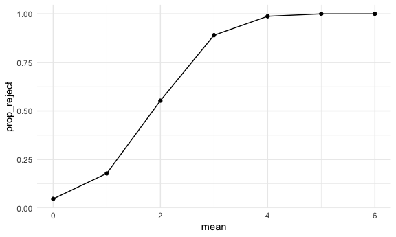

P8105 HW5
================
Jennifer Lee (UNI: jl2361)
2022-12-08

testing git connection

# Problem 1

## Data load & tidying

The code chunk below imports the data in individual spreadsheets
contained in `./data/zip_data/`. To do this, I create a dataframe that
includes the list of all files in that directory and the complete path
to each file. As a next step, I `map` over paths and import data using
the `read_csv` function. Finally, I `unnest` the result of `map`.

``` r
full_df = 
  tibble(
    files = list.files("data/zip_data/"),
    path = str_c("data/zip_data/", files)
  ) %>% 
  mutate(data = map(path, read_csv)) %>% 
  unnest()
```

    ## Rows: 1 Columns: 8
    ## ── Column specification ────────────────────────────────────────────────────────
    ## Delimiter: ","
    ## dbl (8): week_1, week_2, week_3, week_4, week_5, week_6, week_7, week_8
    ## 
    ## ℹ Use `spec()` to retrieve the full column specification for this data.
    ## ℹ Specify the column types or set `show_col_types = FALSE` to quiet this message.
    ## Rows: 1 Columns: 8
    ## ── Column specification ────────────────────────────────────────────────────────
    ## Delimiter: ","
    ## dbl (8): week_1, week_2, week_3, week_4, week_5, week_6, week_7, week_8
    ## 
    ## ℹ Use `spec()` to retrieve the full column specification for this data.
    ## ℹ Specify the column types or set `show_col_types = FALSE` to quiet this message.
    ## Rows: 1 Columns: 8
    ## ── Column specification ────────────────────────────────────────────────────────
    ## Delimiter: ","
    ## dbl (8): week_1, week_2, week_3, week_4, week_5, week_6, week_7, week_8
    ## 
    ## ℹ Use `spec()` to retrieve the full column specification for this data.
    ## ℹ Specify the column types or set `show_col_types = FALSE` to quiet this message.
    ## Rows: 1 Columns: 8
    ## ── Column specification ────────────────────────────────────────────────────────
    ## Delimiter: ","
    ## dbl (8): week_1, week_2, week_3, week_4, week_5, week_6, week_7, week_8
    ## 
    ## ℹ Use `spec()` to retrieve the full column specification for this data.
    ## ℹ Specify the column types or set `show_col_types = FALSE` to quiet this message.
    ## Rows: 1 Columns: 8
    ## ── Column specification ────────────────────────────────────────────────────────
    ## Delimiter: ","
    ## dbl (8): week_1, week_2, week_3, week_4, week_5, week_6, week_7, week_8
    ## 
    ## ℹ Use `spec()` to retrieve the full column specification for this data.
    ## ℹ Specify the column types or set `show_col_types = FALSE` to quiet this message.
    ## Rows: 1 Columns: 8
    ## ── Column specification ────────────────────────────────────────────────────────
    ## Delimiter: ","
    ## dbl (8): week_1, week_2, week_3, week_4, week_5, week_6, week_7, week_8
    ## 
    ## ℹ Use `spec()` to retrieve the full column specification for this data.
    ## ℹ Specify the column types or set `show_col_types = FALSE` to quiet this message.
    ## Rows: 1 Columns: 8
    ## ── Column specification ────────────────────────────────────────────────────────
    ## Delimiter: ","
    ## dbl (8): week_1, week_2, week_3, week_4, week_5, week_6, week_7, week_8
    ## 
    ## ℹ Use `spec()` to retrieve the full column specification for this data.
    ## ℹ Specify the column types or set `show_col_types = FALSE` to quiet this message.
    ## Rows: 1 Columns: 8
    ## ── Column specification ────────────────────────────────────────────────────────
    ## Delimiter: ","
    ## dbl (8): week_1, week_2, week_3, week_4, week_5, week_6, week_7, week_8
    ## 
    ## ℹ Use `spec()` to retrieve the full column specification for this data.
    ## ℹ Specify the column types or set `show_col_types = FALSE` to quiet this message.
    ## Rows: 1 Columns: 8
    ## ── Column specification ────────────────────────────────────────────────────────
    ## Delimiter: ","
    ## dbl (8): week_1, week_2, week_3, week_4, week_5, week_6, week_7, week_8
    ## 
    ## ℹ Use `spec()` to retrieve the full column specification for this data.
    ## ℹ Specify the column types or set `show_col_types = FALSE` to quiet this message.
    ## Rows: 1 Columns: 8
    ## ── Column specification ────────────────────────────────────────────────────────
    ## Delimiter: ","
    ## dbl (8): week_1, week_2, week_3, week_4, week_5, week_6, week_7, week_8
    ## 
    ## ℹ Use `spec()` to retrieve the full column specification for this data.
    ## ℹ Specify the column types or set `show_col_types = FALSE` to quiet this message.
    ## Rows: 1 Columns: 8
    ## ── Column specification ────────────────────────────────────────────────────────
    ## Delimiter: ","
    ## dbl (8): week_1, week_2, week_3, week_4, week_5, week_6, week_7, week_8
    ## 
    ## ℹ Use `spec()` to retrieve the full column specification for this data.
    ## ℹ Specify the column types or set `show_col_types = FALSE` to quiet this message.
    ## Rows: 1 Columns: 8
    ## ── Column specification ────────────────────────────────────────────────────────
    ## Delimiter: ","
    ## dbl (8): week_1, week_2, week_3, week_4, week_5, week_6, week_7, week_8
    ## 
    ## ℹ Use `spec()` to retrieve the full column specification for this data.
    ## ℹ Specify the column types or set `show_col_types = FALSE` to quiet this message.
    ## Rows: 1 Columns: 8
    ## ── Column specification ────────────────────────────────────────────────────────
    ## Delimiter: ","
    ## dbl (8): week_1, week_2, week_3, week_4, week_5, week_6, week_7, week_8
    ## 
    ## ℹ Use `spec()` to retrieve the full column specification for this data.
    ## ℹ Specify the column types or set `show_col_types = FALSE` to quiet this message.
    ## Rows: 1 Columns: 8
    ## ── Column specification ────────────────────────────────────────────────────────
    ## Delimiter: ","
    ## dbl (8): week_1, week_2, week_3, week_4, week_5, week_6, week_7, week_8
    ## 
    ## ℹ Use `spec()` to retrieve the full column specification for this data.
    ## ℹ Specify the column types or set `show_col_types = FALSE` to quiet this message.
    ## Rows: 1 Columns: 8
    ## ── Column specification ────────────────────────────────────────────────────────
    ## Delimiter: ","
    ## dbl (8): week_1, week_2, week_3, week_4, week_5, week_6, week_7, week_8
    ## 
    ## ℹ Use `spec()` to retrieve the full column specification for this data.
    ## ℹ Specify the column types or set `show_col_types = FALSE` to quiet this message.
    ## Rows: 1 Columns: 8
    ## ── Column specification ────────────────────────────────────────────────────────
    ## Delimiter: ","
    ## dbl (8): week_1, week_2, week_3, week_4, week_5, week_6, week_7, week_8
    ## 
    ## ℹ Use `spec()` to retrieve the full column specification for this data.
    ## ℹ Specify the column types or set `show_col_types = FALSE` to quiet this message.
    ## Rows: 1 Columns: 8
    ## ── Column specification ────────────────────────────────────────────────────────
    ## Delimiter: ","
    ## dbl (8): week_1, week_2, week_3, week_4, week_5, week_6, week_7, week_8
    ## 
    ## ℹ Use `spec()` to retrieve the full column specification for this data.
    ## ℹ Specify the column types or set `show_col_types = FALSE` to quiet this message.
    ## Rows: 1 Columns: 8
    ## ── Column specification ────────────────────────────────────────────────────────
    ## Delimiter: ","
    ## dbl (8): week_1, week_2, week_3, week_4, week_5, week_6, week_7, week_8
    ## 
    ## ℹ Use `spec()` to retrieve the full column specification for this data.
    ## ℹ Specify the column types or set `show_col_types = FALSE` to quiet this message.
    ## Rows: 1 Columns: 8
    ## ── Column specification ────────────────────────────────────────────────────────
    ## Delimiter: ","
    ## dbl (8): week_1, week_2, week_3, week_4, week_5, week_6, week_7, week_8
    ## 
    ## ℹ Use `spec()` to retrieve the full column specification for this data.
    ## ℹ Specify the column types or set `show_col_types = FALSE` to quiet this message.
    ## Rows: 1 Columns: 8
    ## ── Column specification ────────────────────────────────────────────────────────
    ## Delimiter: ","
    ## dbl (8): week_1, week_2, week_3, week_4, week_5, week_6, week_7, week_8
    ## 
    ## ℹ Use `spec()` to retrieve the full column specification for this data.
    ## ℹ Specify the column types or set `show_col_types = FALSE` to quiet this message.

The result of the previous code chunk isn’t tidy – data are wide rather
than long, and some important variables are included as parts of others.
The code chunk below tides the data using string manipulations on the
file, converting from wide to long, and selecting relevant variables.

``` r
tidy_df = 
  full_df %>% 
  mutate(
    files = str_replace(files, ".csv", ""),
    group = str_sub(files, 1, 3)) %>% 
  pivot_longer(
    week_1:week_8,
    names_to = "week",
    values_to = "outcome",
    names_prefix = "week_") %>% 
  mutate(week = as.numeric(week)) %>% 
  select(group, subj = files, week, outcome)
```

## Plot

Finally, the code chunk below creates a plot showing individual data,
faceted by group.

``` r
tidy_df %>% 
  ggplot(aes(x = week, y = outcome, group = subj, color = group)) + 
  geom_point() + 
  geom_path() + 
  facet_grid(~group)
```


This plot suggests high within-subject correlation – subjects who start
above average end up above average, and those that start below average
end up below average. Subjects in the control group generally don’t
change over time, but those in the experiment group increase their
outcome in a roughly linear way.

# Problem 2

## Data load & tidying

First, we load the homicide data and do some data tidying.

``` r
homicide_df = 
  read_csv("data/homicide.csv") %>%
  janitor::clean_names() %>%
  mutate(
    state = toupper(state),
    city_state = str_c(city, state, sep = ", ") %>% 
    str_replace("Tulsa, AL", "Tulsa, OK"))
```

    ## Rows: 52179 Columns: 12
    ## ── Column specification ────────────────────────────────────────────────────────
    ## Delimiter: ","
    ## chr (9): uid, victim_last, victim_first, victim_race, victim_age, victim_sex...
    ## dbl (3): reported_date, lat, lon
    ## 
    ## ℹ Use `spec()` to retrieve the full column specification for this data.
    ## ℹ Specify the column types or set `show_col_types = FALSE` to quiet this message.

The raw data reports data on homicides in 50 U.S. cities describing the
date, location, victim details, and case disposition. There are 52179
rows/observations and 13 columns/variables after we create the
`city_state` variable. We note that some state abbreviations are not
completely capitalized and that there appears to be a typo for the city
of Tulsa, so we fix these data entry errors in the above code chunk.

Next, we create a dataframe summarizing the number of total homicides by
city and state, in addition to the number of unsolved homicides
categorized by “Closed without arrest” or “Open/No arrest.”

``` r
number_homicide_df = 
  homicide_df %>%
  group_by(city_state) %>%
  summarize(number_homicide = n()) 

number_unsolved_homicide_df = 
  homicide_df %>%
  filter(disposition %in% c("Closed without arrest", "Open/No arrest")) %>%
  group_by(city_state) %>%
  summarize(number_unsolved_homicide = n()) 

homicide = 
  left_join(number_unsolved_homicide_df, number_homicide_df, by = "city_state") 

homicide %>%
  knitr::kable()
```

| city_state         | number_unsolved_homicide | number_homicide |
|:-------------------|-------------------------:|----------------:|
| Albuquerque, NM    |                      146 |             378 |
| Atlanta, GA        |                      373 |             973 |
| Baltimore, MD      |                     1825 |            2827 |
| Baton Rouge, LA    |                      196 |             424 |
| Birmingham, AL     |                      347 |             800 |
| Boston, MA         |                      310 |             614 |
| Buffalo, NY        |                      319 |             521 |
| Charlotte, NC      |                      206 |             687 |
| Chicago, IL        |                     4073 |            5535 |
| Cincinnati, OH     |                      309 |             694 |
| Columbus, OH       |                      575 |            1084 |
| Dallas, TX         |                      754 |            1567 |
| Denver, CO         |                      169 |             312 |
| Detroit, MI        |                     1482 |            2519 |
| Durham, NC         |                      101 |             276 |
| Fort Worth, TX     |                      255 |             549 |
| Fresno, CA         |                      169 |             487 |
| Houston, TX        |                     1493 |            2942 |
| Indianapolis, IN   |                      594 |            1322 |
| Jacksonville, FL   |                      597 |            1168 |
| Kansas City, MO    |                      486 |            1190 |
| Las Vegas, NV      |                      572 |            1381 |
| Long Beach, CA     |                      156 |             378 |
| Los Angeles, CA    |                     1106 |            2257 |
| Louisville, KY     |                      261 |             576 |
| Memphis, TN        |                      483 |            1514 |
| Miami, FL          |                      450 |             744 |
| Milwaukee, WI      |                      403 |            1115 |
| Minneapolis, MN    |                      187 |             366 |
| Nashville, TN      |                      278 |             767 |
| New Orleans, LA    |                      930 |            1434 |
| New York, NY       |                      243 |             627 |
| Oakland, CA        |                      508 |             947 |
| Oklahoma City, OK  |                      326 |             672 |
| Omaha, NE          |                      169 |             409 |
| Philadelphia, PA   |                     1360 |            3037 |
| Phoenix, AZ        |                      504 |             914 |
| Pittsburgh, PA     |                      337 |             631 |
| Richmond, VA       |                      113 |             429 |
| Sacramento, CA     |                      139 |             376 |
| San Antonio, TX    |                      357 |             833 |
| San Bernardino, CA |                      170 |             275 |
| San Diego, CA      |                      175 |             461 |
| San Francisco, CA  |                      336 |             663 |
| Savannah, GA       |                      115 |             246 |
| St. Louis, MO      |                      905 |            1677 |
| Stockton, CA       |                      266 |             444 |
| Tampa, FL          |                       95 |             208 |
| Tulsa, OK          |                      193 |             584 |
| Washington, DC     |                      589 |            1345 |

## Using prop.test

We then create a `myproptest` function to apply the prop.test function
to estimate the proportion of homicides that are unsolved, apply the
broom::tidy, and save the output (estimated proportion and upper and
lower bounds of the 95% CI). We use `myproptest` for the city of
Baltimore, MD and make use of the `pull` function.

``` r
myproptest = function(number_unsolved_homicide, number_homicide) {
  
    prop.test(number_unsolved_homicide, number_homicide, p = 0.5, alternative = "two.sided") %>%
    broom::tidy() %>%
    select(estimate, conf.low, conf.high)
  
}

baltimore = 
  homicide %>% 
    filter(city_state %in% c("Baltimore, MD"))

baltimore_results =
  myproptest(pull(baltimore, number_unsolved_homicide), pull(baltimore, number_homicide)) %>%
  rename(
    conf_low = conf.low,
    conf_high = conf.high)

baltimore_results
```

    ## # A tibble: 1 × 3
    ##   estimate conf_low conf_high
    ##      <dbl>    <dbl>     <dbl>
    ## 1    0.646    0.628     0.663

Now, we run `prop.test` for each of the cities in the dataset and
extract both the proportion of unsolved homicides and the CIs for each
within a “tidy” pipeline, making use of purrr::map2, list columns, and
unnest.

``` r
homicide_prop = 
  homicide %>%
   mutate(
    prop_data = map2(number_unsolved_homicide, number_homicide, ~ prop.test(.x, .y) %>%
      broom::tidy())) %>%
  unnest(prop_data) %>%
  select(city_state, estimate, conf.low, conf.high) %>%
  rename(
    conf_low = conf.low,
    conf_high = conf.high)

homicide_prop
```

    ## # A tibble: 50 × 4
    ##    city_state      estimate conf_low conf_high
    ##    <chr>              <dbl>    <dbl>     <dbl>
    ##  1 Albuquerque, NM    0.386    0.337     0.438
    ##  2 Atlanta, GA        0.383    0.353     0.415
    ##  3 Baltimore, MD      0.646    0.628     0.663
    ##  4 Baton Rouge, LA    0.462    0.414     0.511
    ##  5 Birmingham, AL     0.434    0.399     0.469
    ##  6 Boston, MA         0.505    0.465     0.545
    ##  7 Buffalo, NY        0.612    0.569     0.654
    ##  8 Charlotte, NC      0.300    0.266     0.336
    ##  9 Chicago, IL        0.736    0.724     0.747
    ## 10 Cincinnati, OH     0.445    0.408     0.483
    ## # … with 40 more rows

## Plot

Finally, we create a plot that shows the estimates and CIs for each
city, and organize cities according to the proportion of unsolved
homicides. We see that Chicago, IL, New Orleans, LA, and Baltimore, MD
are the top 3 cities with the highest proportions of unsolved homicides.

``` r
homicide_prop %>%
  mutate(
    city_state = fct_reorder(city_state, estimate, .desc = TRUE)) %>%
  ggplot(
    aes(x = city_state, y = estimate)) +
  geom_point() +
  geom_errorbar(aes(ymin = conf_low, ymax = conf_high)) + 
  theme(axis.text.x = element_text(angle = 90, vjust = 0.5, hjust = 1))
```


# Problem 3

## Simulations

First, we set the following design elements:

Fix n=30 Fix σ=5 Set μ=0.

We generate 5000 datasets from the model using `expand_grid` and call
this `sim_df`:

x∼Normal\[μ,σ\]

In addition, we create a `sim_ttest` function to map to `sim_df` and
save μ̂ and the p-value arising from a test of H:μ=0 using α=0.05

``` r
sim_ttest = function(n = 30, mean, sigma = 5) {
  
  sim_data = tibble(
    x = rnorm(n = 30, mean, sd = sigma),
  )
    sim_data %>% 
    t.test(mu = 0, conf.level = 0.95, alternative = c("two.sided")) %>%
    broom::tidy() %>%
    select(estimate, p.value)

}

sim_df = 
  expand_grid(
    mean = 0,
    iter = 1:5000) %>% 
  mutate(
    ttest_df = map(.x = mean, ~ sim_ttest(mean = .x))) %>% 
  unnest(ttest_df) %>%
  rename(
      mu_hat = estimate,
      p_value = p.value)

sim_df
```

    ## # A tibble: 5,000 × 4
    ##     mean  iter mu_hat p_value
    ##    <dbl> <int>  <dbl>   <dbl>
    ##  1     0     1 -0.224  0.823 
    ##  2     0     2 -1.29   0.193 
    ##  3     0     3  0.376  0.700 
    ##  4     0     4 -1.38   0.212 
    ##  5     0     5 -1.00   0.250 
    ##  6     0     6  0.306  0.632 
    ##  7     0     7  0.260  0.793 
    ##  8     0     8 -1.73   0.0916
    ##  9     0     9  0.154  0.802 
    ## 10     0    10 -1.18   0.139 
    ## # … with 4,990 more rows

We repeat the above including μ={1,2,3,4,5,6}.

``` r
sim_df2 = 
  expand_grid(
    mean = c(0:6),
    iter = 1:5000) %>% 
  mutate(
    ttest_df = map(.x = mean, ~ sim_ttest(mean = .x))) %>% 
  unnest(ttest_df) %>%
  rename(
      mu_hat = estimate,
      p_value = p.value)

sim_df2
```

    ## # A tibble: 35,000 × 4
    ##     mean  iter  mu_hat p_value
    ##    <int> <int>   <dbl>   <dbl>
    ##  1     0     1  0.754   0.406 
    ##  2     0     2  1.98    0.0433
    ##  3     0     3 -0.0484  0.955 
    ##  4     0     4 -0.730   0.436 
    ##  5     0     5 -0.186   0.822 
    ##  6     0     6  1.30    0.186 
    ##  7     0     7  0.525   0.562 
    ##  8     0     8  0.251   0.801 
    ##  9     0     9  0.546   0.512 
    ## 10     0    10 -1.36    0.134 
    ## # … with 34,990 more rows

## Plots

Here is a plot showing the proportion of times the null was rejected
(the power of the test), assuming a 5% level of significance, on the y
axis and the true value of μ on the x axis. As the effect size gets
bigger, we see that power increases as well.

``` r
sim_df2 %>% 
  mutate(
    reject = if_else(p_value < 0.05, "y", "n")) %>%
  group_by(mean, reject) %>%
  summarize(
    num_reject = n()) %>%
  mutate(
    prop_reject = num_reject/5000) %>%
  filter(reject == "y") %>%
  ggplot(
    aes(x = mean, y = prop_reject)) +
  geom_point() + geom_line()
```

    ## `summarise()` has grouped output by 'mean'. You can override using the
    ## `.groups` argument.



Next, here is a plot showing the average estimate of μ̂ on the y axis and
the true value of μ on the x axis. There is also a second plot (right)
showing the average estimate of μ̂ only in samples for which the null was
rejected, assuming a 5% level of significance, on the y axis and the
true value of μ on the x axis.

The sample average of μ̂ across tests for which the null is rejected is
not approximately equal to the true value of μ, **especially as the
effect size is smaller and power is lower**.

``` r
mean_plot1 =
  sim_df2 %>% 
  group_by(mean) %>%
  summarize(
    avg_muhat = mean(mu_hat)) %>%
  ggplot(
    aes(x = mean, y = avg_muhat)) +
  geom_point() + geom_line() +
  labs(title = "Average mu hat for all samples")

mean_plot2 =
  sim_df2 %>% 
    mutate(
    reject = if_else(p_value < 0.05, "y", "n")) %>%
  filter(reject == "y") %>%
  group_by(mean) %>%
  summarize(
    avg_muhat = mean(mu_hat)) %>%
  ggplot(
    aes(x = mean, y = avg_muhat)) +
  geom_point() + geom_line() +
  labs(title = "Samples for null rejected only")

mean_plot1 + mean_plot2
```


Here are plots that depict similar information as above but with all μ̂
represented, not just the average estimate of μ̂.

``` r
mean_plot3 =
  sim_df2 %>% 
  ggplot(
    aes(x = mean, y = mu_hat)) +
  geom_point(alpha = 0.5) +
  labs(title = "Mu hat for all samples")

mean_plot4 =
  sim_df2 %>% 
    mutate(
    reject = if_else(p_value < 0.05, "y", "n")) %>%
  filter(reject == "y") %>%
  ggplot(
    aes(x = mean, y = mu_hat)) +
  geom_point(alpha = 0.5) +
  labs(title = "Samples for null rejected only")

mean_plot3 + mean_plot4
```


